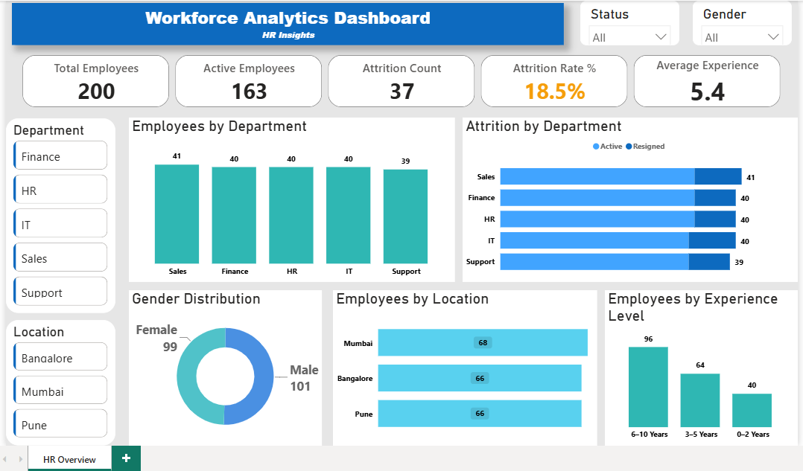

# HR Analytics Dashboard

## Project Overview

Developed an interactive HR Analytics Dashboard using PostgreSQL and Power BI to analyze employee data, workforce trends, and attrition metrics. The project demonstrates end-to-end data analysis, from SQL-based data extraction and transformation to interactive dashboard development using Power BI.

## Dashboard Preview

## Tools Used

- PostgreSQL
- pgAdmin 4
- Power BI
- DAX Measures
- SQL Joins
- Aggregate Functions
- Subqueries

## Key Metrics

- Total Employees: **200**
- Active Employees: **163**
- Attrition Count: **37**
- Attrition Rate: **18.5%**
- Average Experience: **5.4 Years**
- Gender Distribution: **101 Male | 99 Female**
- Department Distribution: **5 Departments**

## Key Insights

- Analyzed **200 employee records** across **5 departments**.
- Tracked workforce trends using interactive KPIs, slicers, and visualizations.
- Identified an overall **18.5% attrition rate** and department-wise employee distribution.
- Analyzed employee experience levels, gender distribution, and location-wise workforce.
- Enabled quick business insights through interactive Power BI dashboards.

## Purpose

This project was created to strengthen data analysis and dashboard development skills using PostgreSQL and Power BI while building a practical analytics portfolio.
